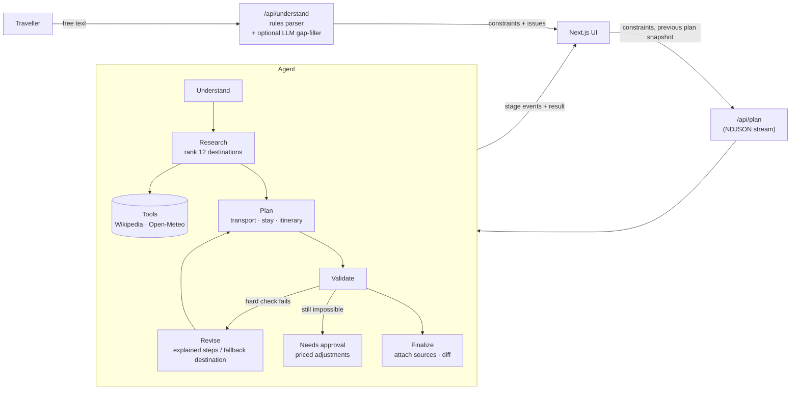

# Wayfare — an AI travel agent that respects your budget and pace

> Describe a trip in plain words — *"6 days from Delhi for 2 people under ₹50K, nature and food, relaxed"* — and Wayfare picks a destination, builds a day-by-day plan, checks it against every constraint, fixes what doesn't fit, and adapts when you change your mind. It tells you exactly what changed, why, and what stayed the same.

---


## 1. What it does

- **Understands** a free-text request and turns it into structured constraints — origin, destination, travellers, days, budget, interests, pace, dates — showing which values you *stated*, which were *interpreted* and which were *assumed*.
- **Researches**: compares 12 Indian destinations on interest fit, activity depth, season, travel burden and cost; looks up the chosen one live on **Wikipedia** and **Open-Meteo**.
- **Plans** transport (bus / 3AC train / flight, door to door), a stay tier, and a day-by-day itinerary with times, travel time between stops, food picks and daily spend.
- **Validates** the plan against hard constraints (budget, length, travellers, origin, pace, schedule, seasonal closures) and preferences (interests, travel burden, weather).
- **Revises** automatically when a hard constraint breaks — and when it can't, **asks for approval** with priced alternatives instead of presenting an impossible trip.
- **Replans** when you change something, keeping what still works and showing a plain-language diff.
- **Grounds** every claim: live facts are linked and time-stamped; curated facts, estimates and planner suggestions are labelled as such.

## 2. The problem

Most "AI trip planners" produce a confident paragraph. It rarely fits the budget, ignores how long travel actually takes, packs eight things into a "relaxed" day, and cites nothing. When you change one detail, you get a completely different answer with no explanation.

Wayfare treats a trip as a **constraint problem with a human in the loop**: numbers come from a transparent model, facts come from named sources, and every change is explained.

## 3. Why this is an agent, not a chatbot

| A chatbot | Wayfare |
|---|---|
| One prompt in, text out | A loop: understand → research → plan → validate → revise → explain |
| Numbers are whatever the model writes | Costs and times come from a documented model and add up (tested) |
| Can't tell when it's wrong | An independent validator checks the output; the reviser fixes violations |
| Silently ignores impossible requests | Detects the conflict, explains it, proposes priced fixes, waits for approval |
| Re-asking regenerates everything | Targeted replanning keeps the destination and activities that still work |
| Progress spinners are decorative | The UI streams the agent's real stage events |

The design deliberately uses **one agent with clearly separated stages** rather than many agents: the judges' guidance — "more agents ≠ better" — matches our experience that deterministic planning plus narrow, validated model use is more reliable.

## 4. Architecture



| Layer | Where | Responsibility |
|---|---|---|
| Types & schemas | `src/lib/agent/types.ts`, `schema.ts` | One shared vocabulary; zod validation of everything from the browser |
| Understanding | `parser.ts`, `understand.ts`, `llm/` | Rules first; an optional model (Claude or local Qwen via Ollama) only fills gaps, and only with evidence in the text |
| Data | `src/lib/data/places.ts`, `guides.ts` | Curated destinations, attractions, dishes, stay tiers, seasons |
| Tools | `src/lib/tools/` | Wikipedia + Open-Meteo clients: timeouts, size caps, schema checks, sanitisation, cache, rate-limit retry |
| Planning | `selector.ts`, `transport.ts`, `itinerary.ts`, `planner.ts`, `pricing.ts` | Pure, deterministic, testable |
| Validation & revision | `validator.ts`, `reviser.ts` | Independent checks; explained fixes; approval-gated adjustments |
| Replanning | `replan.ts` | Snapshot, sticky destination, activity preference, diff |
| Orchestration | `agent.ts`, `app/api/plan/route.ts` | Runs the stages, streams real events, enforces a deadline |
| UI | `src/components/` | Planner flow, trip views, sources, dialog |

More detail: [`docs/ARCHITECTURE.md`](docs/ARCHITECTURE.md).

## 5. Main flow

1. **Request** — type a trip or pick an example.
2. **Understood** — a summary grid shows each extracted value and whether you said it, we interpreted it, or we assumed it. Missing or impossible values block planning until you fix them in the form.
3. **Planning** — five stages stream in as they finish, with real details ("Compared 12 destinations — Manali fits best; checked 3 live sources").
4. **Trip** — overview (photo, description, why this place, what else was considered), budget, constraint checks, transport and stay reasoning, a stop map, the day-by-day timeline and the sources panel.
5. **Change trip** — one-tap changes (*Budget ₹50,000 → ₹35,000*, *Pace Relaxed → Packed*, *Interest Nature → History*) or the full editor.
6. **What changed** — the diff: changed constraints, what was updated and why, what stayed the same.

## 6. Tools and APIs

| Tool | Used for | Key? | Failure behaviour |
|---|---|---|---|
| Wikipedia REST (`page/summary`) | Destination description & photo; links for attractions | No | Plan continues; no links shown; UI says the lookup failed |
| Open-Meteo forecast / archive | Forecast for trips ≤ 14 days out, otherwise the same dates last year | No | Plan continues; notice says there's no weather check |
| Claude (optional) | Filling gaps in free-text understanding | `ANTHROPIC_API_KEY` | Falls back to rules |
| Local model via Ollama (optional, e.g. Qwen3 8B) | Same as above, on-device | None | Falls back to rules |

Only these were added because each changes the output: descriptions and photos become sourced, weather feeds a validation check, and a model makes loose phrasing ("the missus", "a long week") understandable. All calls are server-side; the browser only talks to our own API (`connect-src 'self'`).

## 7. Constraint handling

- **Hard** (must hold, or the plan is flagged): budget (with a 7% contingency buffer), trip length, travellers (rooms and per-person costs), origin, a destination you named, pace ceiling (relaxed ≤ 2 / balanced ≤ 3 / packed ≤ 5 activities a day), schedule sanity (no overlaps, sensible hours), seasonal closures.
- **Soft** (warnings): interest coverage and on-topic share, travel burden, season and weather.
- **Revision ladder** when the budget breaks: cheapest transport → cheaper stay → simpler meals → shared local transport → free-first activities → further stay/meal cuts → (if you left the destination open) a cheaper destination that still suits your interests. Each step records what it saved.
- **Approval**: if nothing fits, the plan is marked *needs approval* with adjustments priced by actually re-planning: raise the budget to ₹X, shorten to N days, go to Y instead, or (when travel is too long) lengthen the trip.
- **Understanding-time conflicts**: contradictory pace ("relaxed but packed"), solo-for-three, weekend-but-10-days, luxury on a shoestring, negative or absurd numbers, unsupported places — each is flagged with a message, never silently resolved.

## 8. Replanning

The client sends a compact **snapshot** of the current plan with the new constraints. The server rebuilds all display text from IDs (never trusting client strings), then:

1. Works out which constraints changed.
2. **Keeps the destination** unless you changed it or another is clearly better (score margin).
3. **Prefers the same activities** where they still fit the new interests and pace.
4. Re-runs planning, validation and revision.
5. Produces a diff — e.g. *"Your lower budget changed the stay. Your nature and food preferences were preserved, and 7 of 7 activities stayed the same."*

## 9. Grounding

Every piece of information carries one of four labels, shown in the UI:

| Label | Meaning | Example |
|---|---|---|
| **Checked live** | Fetched during this run, with URL and retrieval time | Destination description, attraction links, weather |
| **From our guide** | Curated reference data | Attractions, dishes, neighbourhoods |
| **Estimate** | From the documented cost/time model | Fares, room rates, entry fees, travel times |
| **Our suggestion** | A planning choice | Timings, destination choice |

Rules we enforce (and test):
- A Wikipedia link is shown **only** if the article was fetched in this run; failed lookups remove the link rather than leaving an unchecked one.
- Articles whose coordinates are > 60 km from the place are rejected (e.g. the "Fontainhas" article is about a place ~10,400 km from Goa — caught and dropped).
- Stays are described by **type and area**, never invented hotel names. No invented reviews, opening hours, availability or prices presented as quotes.
- Past weather is labelled "not a forecast".
- A language model may only *extract*; values it returns must be supported by evidence in your text (small models invent numbers — we saw Qwen return a ₹0 budget for "trip to Paris").

## 10. Security

- **Untrusted input everywhere**: zod-validated bodies (`.strict()`), a 32 KB body cap enforced while streaming, JSON-only content type, same-origin check on POST, per-client rate limits (429 + `Retry-After`), a 45 s planning deadline.
- **Prompt injection**: instruction-like text, markup, script URLs and hidden Unicode are stripped from requests before parsing (and reported to the user). Model prompts wrap the request in `<trip_request>` tags and instruct the model to treat it as data; outputs are schema-constrained and re-validated.
- **Indirect injection**: Wikipedia text is sanitised — tags, hidden characters, links and instruction-like sentences are dropped; only Wikimedia image hosts and `en.wikipedia.org` page links are accepted.
- **Client-sent replan snapshots** are validated and their display strings rebuilt server-side.
- **Secrets**: only read from environment variables on the server; never logged, never returned (tested). `.env*` is git-ignored except `.env.example`.
- **Headers**: CSP (no third-party scripts, `connect-src 'self'`, `frame-ancestors 'none'`), `X-Frame-Options`, `nosniff`, strict referrer, permissions policy, HSTS in production.
- **No excessive agency**: the agent only reads public data; it never books, pays or messages anyone.
- **Logs**: one JSON line per event with a request ID — outcomes and timings only, never user text or model output.

## 11. Evaluation strategy

Three layers, all property-based (they check what must be true, not exact wording):

1. **Unit & integration tests** (`tests/`) — parser, planner, grounding/tools, agent, LLM providers, security.
2. **Golden evaluation set** (`evals/`) — 23 end-to-end cases across understanding, planning, personalisation, constraints, replanning, safety and tool failure. Every plan is also checked against universal invariants (trip length, budget-or-approval, pace ceiling, no repeats, budget arithmetic, traceable sources, resolvable citations, status consistency, **stage trajectory**). A sanity suite proves each check fails on deliberately broken plans. Writes [`evals/results/latest.md`](evals/results/latest.md).
3. **LLM-as-a-judge** (`evals/judge/`) — a local model scores real plans on constraint fit, personalisation, pacing and practicality, alongside a deliberately broken control plan. The judge is only trusted if it scores the control clearly lower. Latest run (Qwen3 8B): real plans **3.80/5**, broken control **1.00/5** — see [`evals/results/judge-latest.md`](evals/results/judge-latest.md). It's a noisy smoke test, not ground truth; its critiques fed back into the planner.

## 12. Testing

```bash
npm test              # all unit, integration, security tests + the golden eval set (offline, deterministic)
npm run eval          # just the eval set; writes evals/results/latest.{md,json}
npm run eval:judge    # LLM-as-a-judge (needs Ollama + qwen3:8b, or JUDGE_MODEL=...)
npm run lint
npm run typecheck
npm run build
```

Tests run with live lookups off and no model (`vitest.config.mts`), with a fake `fetch` simulating healthy, failing, malformed, slow, rate-limited and malicious responses. CI (`.github/workflows/ci.yml`) runs lint, typecheck, tests + evals and the build on every push.

## 13. Local setup

Requirements: Node.js ≥ 20.9 (developed on Node 24), npm.

```bash
git clone https://github.com/MAD1IZJOD/ai-travel-agent.git
cd ai-travel-agent
npm install
cp .env.example .env.local   # optional — everything works without it
npm run dev                  # http://localhost:3000
```

Optional local model: install [Ollama](https://ollama.com), `ollama pull qwen3:8b`, and set `LLM_PROVIDER=ollama`, `OLLAMA_MODEL=qwen3:8b` in `.env.local`.

## 14. Environment variables

| Variable | Default | Purpose |
|---|---|---|
| `LLM_PROVIDER` | auto | `ollama`, `anthropic` or `none`. Auto = Claude if a key is set, else Ollama if `OLLAMA_MODEL` is set, else rules only |
| `OLLAMA_MODEL` | — | Local model name, e.g. `qwen3:8b` |
| `OLLAMA_BASE_URL` | `http://localhost:11434` | Ollama endpoint (http/https only) |
| `ANTHROPIC_API_KEY` | — | Enables Claude for request understanding (server-side only) |
| `ANTHROPIC_MODEL` | `claude-opus-5` | Claude model override |
| `WAYFARE_OFFLINE` | — | `1` disables Wikipedia/Open-Meteo; the UI says so |
| `JUDGE_MODEL` | `qwen3:8b` | Model for `npm run eval:judge` |

## 15. Running

```bash
npm run dev                       # development
npm run build && npm start        # production (standalone output)
docker build -t wayfare . && docker run -p 3000:3000 wayfare
```

`GET /api/health` reports whether live lookups and the request assistant are enabled (never keys or URLs). *The Dockerfile targets the verified standalone build; the image itself was not built in our environment (no Docker available).*

## 16. Project structure

```
src/
  app/
    api/understand/route.ts   free text → constraints (+ issues)
    api/plan/route.ts         runs the agent, streams NDJSON events
    api/health/route.ts       feature status
    page.tsx, layout.tsx      app shell
  components/
    planner/                  request form, constraint review/editor, progress, quick changes, dialog, run hook
    trip/                     overview, itinerary, budget, checks, logistics, map, sources, change summary, approval
    ui/primitives.tsx         buttons, cards, badges, headings
  lib/
    agent/                    types, schemas, parser, understand, llm/, selector, transport, itinerary,
                              planner, pricing, research, validator, reviser, replan, agent (orchestrator)
    data/                     places (origins, destinations) and curated guides
    tools/                    Wikipedia, Open-Meteo, shared fetch/cache/sanitiser
    server/                   request guards, rate limiter, structured logs
tests/                        unit, integration, security (+ helpers: fake fetch, agent runner)
evals/                        golden dataset, checks, harness, scorecard, LLM judge, results/
docs/ARCHITECTURE.md
```

## 17. Known limitations

- **12 destinations, 6 origin cities.** Everything else is refused rather than guessed.
- **Prices are estimates** from a documented model and typical 2025 prices — no live fares, hotel availability or bookings.
- **One base per trip** — no multi-city routing.
- **Travel times between stops** use straight-line distance × a road factor, not a routing API.
- **Weather** beyond 14 days is last year's observations, not a forecast.
- **Rule-based understanding** covers common phrasings in English; unusual phrasing relies on the optional model.
- **In-memory** rate limiting and caches suit a single instance.
- The LLM judge is a small local model — useful as a smoke test, noisy as a metric.

## 18. Future improvements

- Live fares and availability (rail, bus aggregators, hotel APIs) with the same verified/estimate labelling.
- A routing API for door-to-door times between stops.
- Multi-city trips and day trips from a base.
- More destinations with a data-review pipeline for the curated guide.
- Shared state (Redis) for rate limits and caches across instances.
- Expanding the judge to a larger model and adding human-rated reference plans.

## 19. Development history

The project was built in focused, incremental commits on `main`. Each milestone was tested before the next began.

| # | Commit | Milestone | What it added |
|---|---|---|---|
| 1 | `f7d58c2` | Foundation | Next.js 16 + TypeScript app, design tokens, UI primitives, security headers, core domain types, vitest |
| 2 | `45201f3` | Understanding | Rule-based parser for origin, destination, travellers, days, budget, interests, pace and dates; stated/interpreted/assumed labels; issue detection; optional Claude gap-filling; `/api/understand` |
| 3 | `338c88c` | Planning engine | Curated guides for 12 destinations, documented cost/time model, door-to-door transport choice, destination ranking, pace-aware itinerary builder, budget roll-up |
| 4 | `73b8a2b` | Grounding | Wikipedia and Open-Meteo tools with timeouts, size caps, schema checks, sanitisation, caching and rate-limit retry; verified/reference/estimated/suggestion labels |
| 5 | `edf41fb` | Validation & replanning | Independent constraint validator, explained budget revisions, approval-gated adjustments, targeted replanning with a what-changed diff, streaming `/api/plan` |
| 6 | `f5feb99` | Interface | Full planning UI (progress, overview, timeline, budget, checks, map, sources, change dialog, approval flow) and the optional local Qwen3 8B helper via Ollama |
| 7 | `97aed30` | Security | Same-origin checks, body limits, rate limits, planning deadline, structured logs, `/api/health`, HSTS, Dockerfile, security tests |
| 8 | `a3d98e2` | Evals & docs | 23-case golden evaluation set with universal invariants, sanity suite, LLM-as-a-judge, CI workflow, README and architecture docs |
| 9 | `6e41085` | Bug fix | Fixed plans showing previous-trip data: hyphenated interests, model cold-start timeout fallback, origin echoed as destination, and a latest-request-wins guard |
| 10 | `6a32834` | Evaluation report | Added `hack_evaluation.md`, a self-assessment against the hackathon rubric |
| 11 | `6c6694d` | Evaluation tooling | Added the evaluation skill configuration used to produce that report |
| 12 | `a2d3706`, `ae969f8` | Team edits | Whitespace-only edits to the README and judge config by teammates |
| 13 | this commit | Docs | This development-history section |

View the full history with `git log --oneline`.

Developed with love of my teammates of hackathon winning team Nymeria 
1. Madhavan Sahu
2. Garv Goyal
3. Nidhish Mathur
